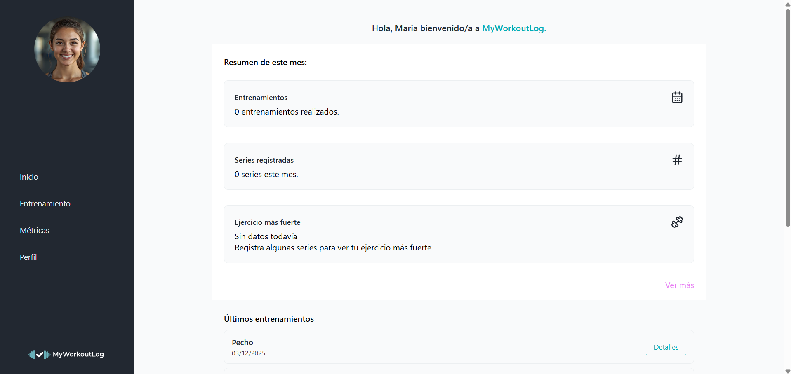

# MyWorkoutLog - 2025

MyWorkoutLog es una aplicación web que permite a los usuarios registrarse para poder progresar siguiendo patrones reales de entrenamiento y, al mismo tiempo, realizar un seguimiento detallado de sus rutinas. Esta aplicación ofrece la oportunidad de registrar las fechas de cada día de entrenamiento, los ejercicios realizados, así como los datos de cada serie (peso utilizado, número de series y repeticiones). Además, esta aplicación web incluye un sistema de métricas que permite evaluar el progreso del usuario y mejorar la planificación de sus entrenamientos. 

  

El objetivo principal de este proyecto es desarrollar una aplicación web completa denominada 
MyWorkoutLog que incorpore un sistema CRUD. Esta aplicación estará orientada al seguimiento y análisis del rendimiento en entrenamientos de fuerza. La aplicación permitirá a los usuarios registrar sus entrenamientos de forma personalizada, gestionar los datos de cada sesión (peso, repeticiones y series) y consultar métricas de progreso que reflejen su evolución a lo largo del tiempo. 

## Video de presentación

  

  <a href="https://youtu.be/83oGZXK-xz0" target="_blank">Abrir video en YouTube</a>

## Demo

  

## Requisitos

- XAMPP (Apache y MySQL/MariaDB)
- Navegador web
- phpMyAdmin (incluido en XAMPP)

## Instalación en local con XAMPP

### 1) Despliegue del proyecto

1. Localiza la carpeta donde está instalado XAMPP (normalmente `C:\xampp`).
2. Dentro de `C:\xampp\htdocs\`, crea una carpeta llamada `myworkoutlog`.
3. Copia el contenido del proyecto dentro de `C:\xampp\htdocs\myworkoutlog\`.

Resultado esperado:

- `C:\xampp\htdocs\myworkoutlog\`

Comprueba que dentro de `myworkoutlog` se encuentran los archivos y carpetas del proyecto.

### 2) Creación de la base de datos

1. Abre el navegador y accede a phpMyAdmin:
   - `http://localhost/phpmyadmin`
2. En el menú superior, pulsa en “Bases de datos”.
3. En el campo “Crear base de datos”, escribe `myworkoutlog`.
4. Pulsa en “Crear”.

### 3) Importación de tablas

1. Selecciona la base de datos `myworkoutlog` en el panel izquierdo de phpMyAdmin.
2. Ve a la pestaña “Importar”.
3. Pulsa en “Seleccionar archivo”.
4. Elige el archivo `myworkoutlog.sql`.
5. Asegúrate de que el formato es SQL y mantén las opciones por defecto.
6. Pulsa en “Importar” y espera a que se complete.

Verifica que se han creado correctamente las tablas (usuarios, ejercicios, entrenamientos, series, etc.).

Después, importa también el archivo `maria_entrenamientos.sql` siguiendo el mismo procedimiento.

### 4) Puesta en marcha de la aplicación

1. Asegúrate de que Apache y MySQL están en ejecución en el panel de control de XAMPP.
2. Abre el navegador y accede a:
   - `http://localhost/myworkoutlog`
3. Si todo es correcto, se mostrará la pantalla de login/registro de MyWorkoutLog.

## Acceso desde el teléfono móvil (misma red local)

Para visualizar la aplicación en un teléfono móvil conectado a la misma red local:

1. En el ordenador, inicia Apache y MySQL desde el panel de control de XAMPP.
2. Abre una terminal (Símbolo del sistema o PowerShell) y ejecuta:
   - `ipconfig`
3. Localiza “Adaptador de LAN inalámbrica Wi-Fi” y anota la dirección IPv4 (por ejemplo, `192.168.1.165`).
4. Asegúrate de que el ordenador y el móvil están conectados a la misma red Wi-Fi.
5. En el navegador del móvil, escribe:
   - `http://DIRECCION_IPV4/myworkoutlog`
   - Ejemplo: `http://192.168.1.165/myworkoutlog`

Si la configuración es correcta, MyWorkoutLog se mostrará en el navegador del teléfono igual que en el ordenador.

